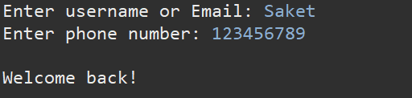
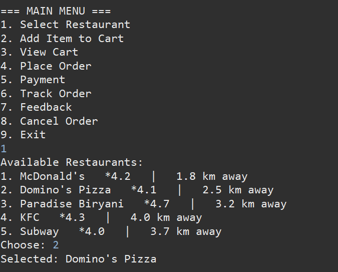
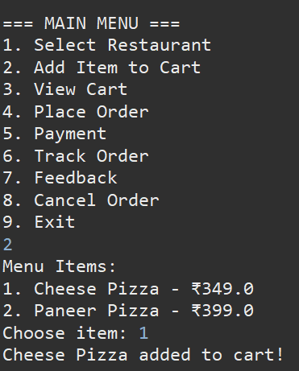
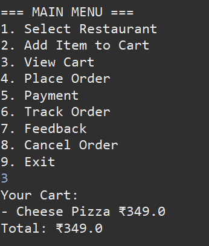
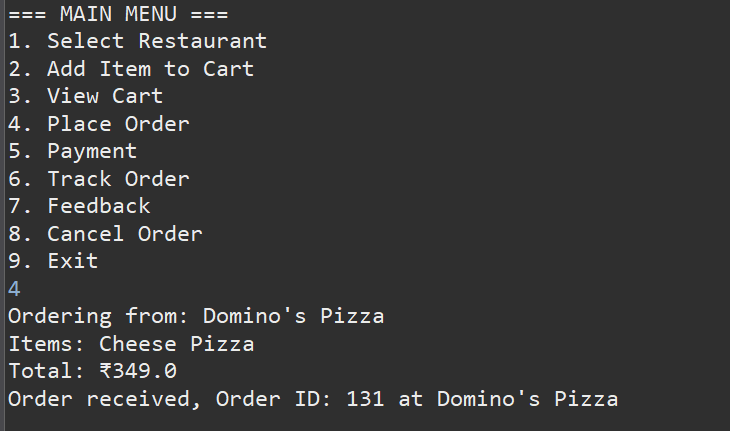
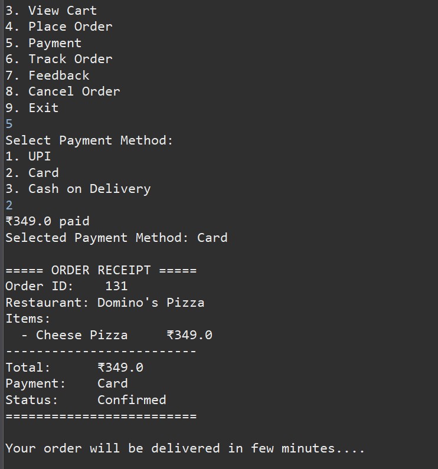
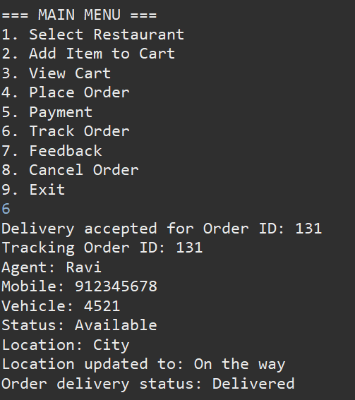
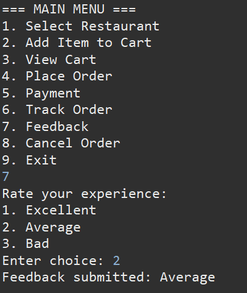
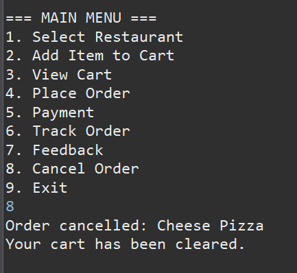
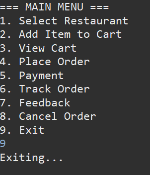

# Online Food Delivery Management System

This is a case study group project for CSE111.This a console based food order app with java concepts.

---

## Team members
1. Sputhnik.P (AM.SC.U4CSE25340)-Coded the classes (Menu, Order, delivery)   
2. Saket.C (AM.SC.U4CSE25345)-Coded Main class and finished the code.   
3. M.Vishnu Yaswanth (AM.SC.U4CSE25334)-Code the classes( User,restaurant).      
4. Swapnil.N (AM.SC.U4CSE25337)-Idea logic and UML diagrams.    

---

## Problem Description

Customers want convenient food ordering. Phone-based systems cause delays and errors. A 
centralized digital platform is needed. Modern lifestyles have increased demand for convenient food 
ordering. Customers prefer ordering through apps instead of visiting restaurants. However, phone-
based ordering leads to miscommunication, delays, and incorrect deliveries. Restaurants struggle to 
manage multiple orders efficiently. Delivery coordination is another challenge. Without a structured 
system, delays and dissatisfaction occur. An Online Food Delivery System integrates customers, 
restaurants, and delivery agents on a single platform, ensuring smooth order processing and tracking.

---

## How to Run

1.First enter your name and phone number.        
2.Enter choice as 1 and Select your preferred restaurants from the list.   
3. enter choice as 2 Add items to the cart  
4.You can view cart when enering choice as 3  
5.Enter choice as 4 to Place the order  
6.enter 5 to Pay for the order using your perferred payment.  
7.enter choice 6 for You can track order and view driver details  
8.enter choice 7 so You can also submit feedback.   
9.Enter choice 8 to Exit the program.   

---

## Sample Input and Output

The inputs are BLUE in colour and the outputs are in WHITE.

### Login

### Restaurant Selection

### Add to Cart

### view Cart

### Order Placed

### Payment

### Track order

### Feedback

### Cancel Order

### Exit program

---

## Tools and Technologies Used

1.Java    
2.OOP Concepts (Classes encapsulation)  
3.File Input/Output (Saving user and order to txt files    
4.Exception Handing (Handling wrong inputs by user)    
5.Eclipse (IDE Used for testing and deleoping code)   
6.Github (Repo hosting)     
7.Array List (collection of objects)

