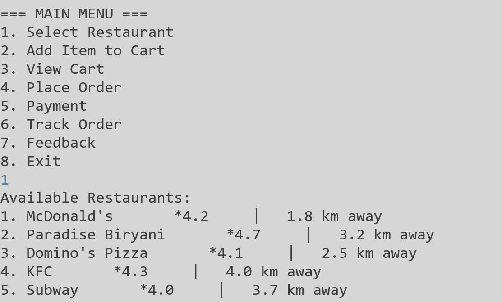
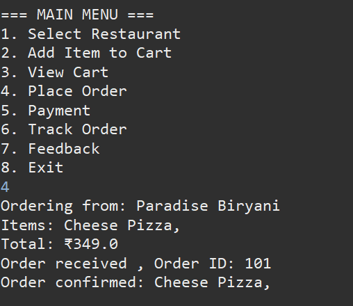

# Online Food Delivery Management System

This is a case study group project for CSE111.This a console based food order app with java concepts.

---

## Team members
1. Sputhnik.P (AM.SC.U4CSE25340)-Main java implementation
2. Saket.C (AM.SC.U4CSE25345)-Output Screenshots and Github Setup
3. M.Vishnu Yaswanth (AM.SC.U4CSE25334)-Testing and Documentation
4. Swapnil.N (AM.SCU4CSE25337)-Class Design and UML Diagrams

---

##Problem Description

Customers want convenient food ordering. Phone-based systems cause delays and errors. A 
centralized digital platform is needed. Modern lifestyles have increased demand for convenient food 
ordering. Customers prefer ordering through apps instead of visiting restaurants. However, phone-
based ordering leads to miscommunication, delays, and incorrect deliveries. Restaurants struggle to 
manage multiple orders efficiently. Delivery coordination is another challenge. Without a structured 
system, delays and dissatisfaction occur. An Online Food Delivery System integrates customers, 
restaurants, and delivery agents on a single platform, ensuring smooth order processing and tracking.

---

##How to Run

1.Clone the repo(git clone https://github.com/SaketC86/CSE111_CaseStudy_GroupD2)
2.Open project in Eclipse or IntelliJ
3.Go to Main.java
4.Click Run code
5.Enter the inputs in the console and navigate through the app

---

## Sample Input and Output

### Registration

### Restaurant Selection

### Order Placed

---

## Tools and Technologies Used

1.Java
2.OOP Concepts (Classes encapsulation) 
3.File Input/Output (Saving user and order to txt files 
4.Exception Handing (Handling wrong inputs by user) 
5.Eclipse (IDE Used for testing and deleoping code) 
6.Github (Repo hosting) 

